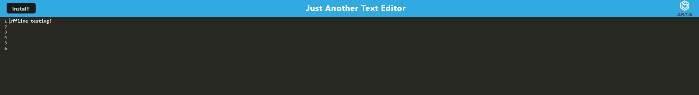

# PWA_RV

## Description

- What was your motivation?  
  This application uses technologies like webpack along with server functionality and this was made to further understand how to use said technologies.

- Why did you build this project?  
  To practice using webpack technology, and bundling.

- What problem does it solve?  
  It creates a simple note taker deplyed to Heroku

- What did you learn?  
  How to implement and generate a dist folder with webpack
   
- Briefly describe your Project:  
  This is an application where a user can write and use as a console, it works offline and you can download the working application to your PC.
   

## Table of Contents

- [Description](#description)
- [Images](#images)
- [Installation](#installation)
- [Usage](#usage)
- [License](#license)
- [Contributors](#contributors)
- [Questions](#questions)

## Images

## Installation

What are the steps required to install your project?

    Clone this repository, "npm i"

## Usage

Provide instructions for use:

    In your terminal "npm run dev:start"

## Contributors

Enoc Rojas Villegas

## Questions

Check out my work as well!
Find me on GitHub: 
 (https://github.com/Enrique-Rojas-Villegas)  
Email me: 📧 rojiyoyo@gmail.com
